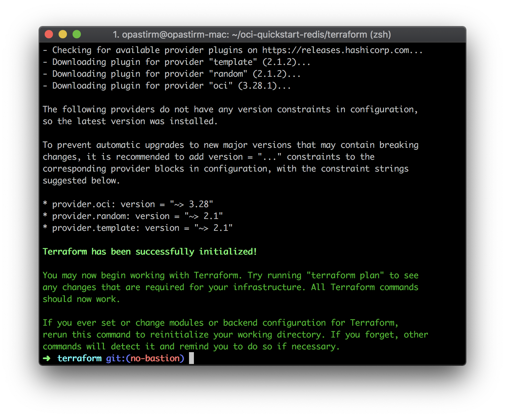
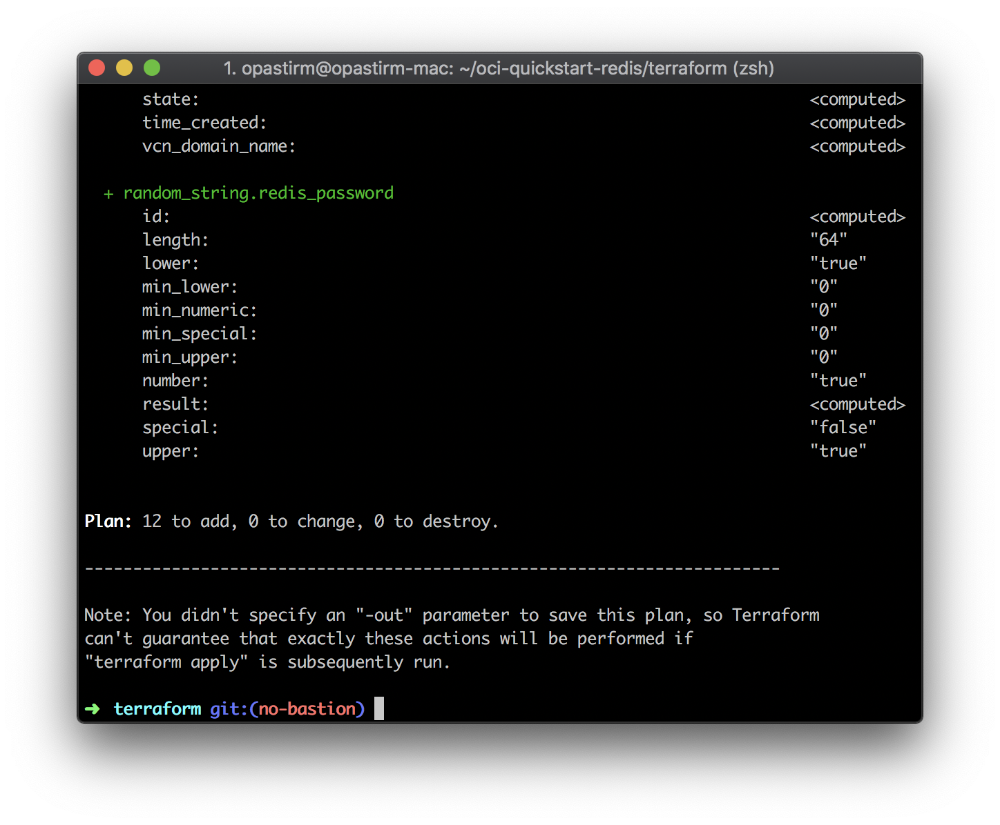
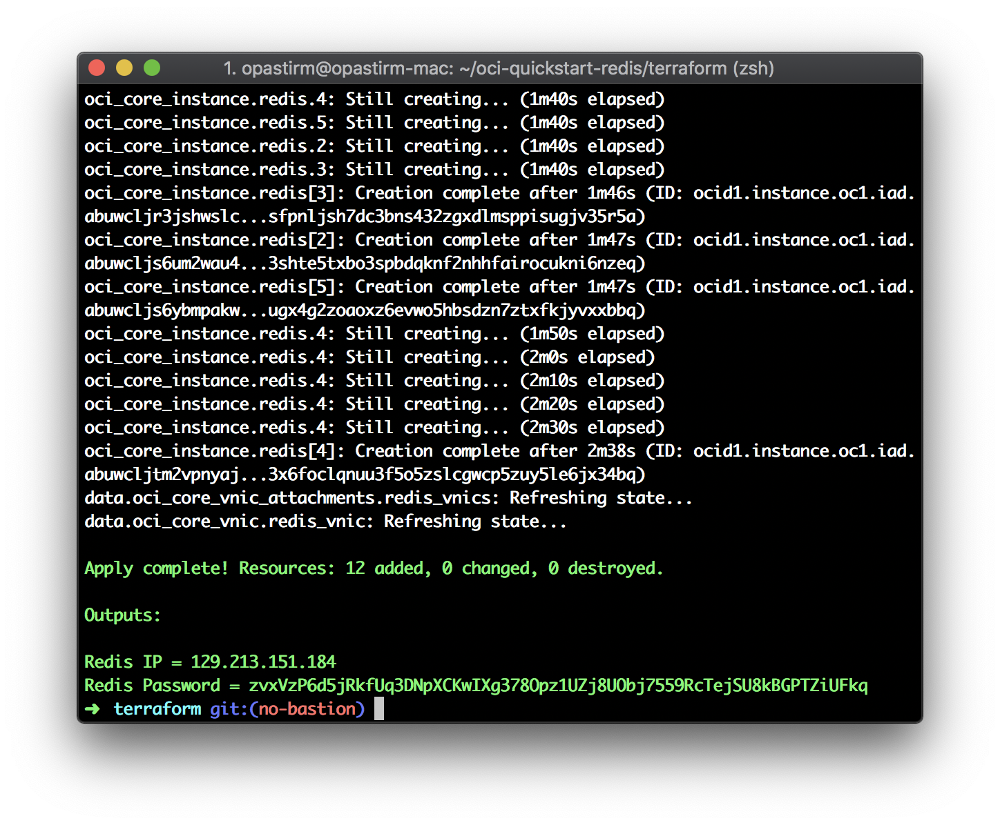
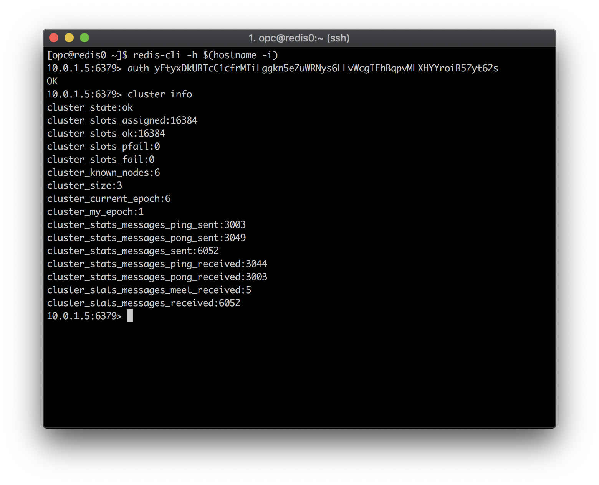
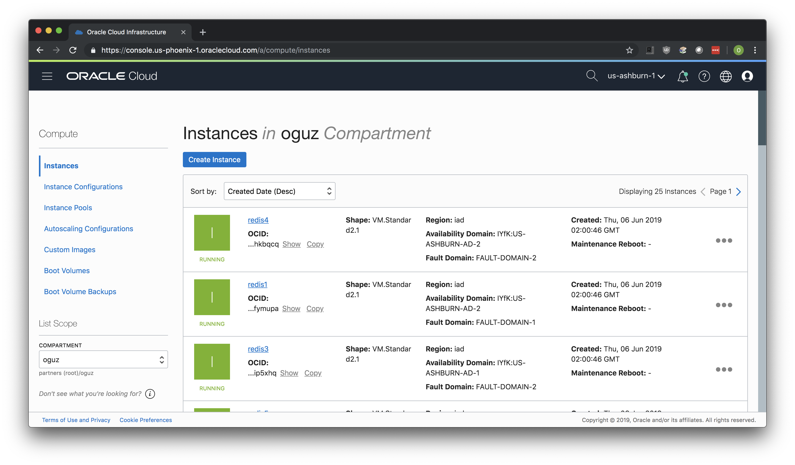
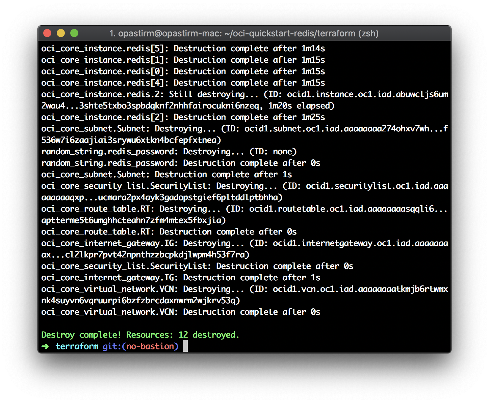

# oci-redis
This is a Terraform module that deploys [Redis](https://redis.io) on [Oracle Cloud Infrastructure (OCI)](https://cloud.oracle.com/en_US/cloud-infrastructure). It is developed jointly by Oracle and Redis Labs.

## Prerequisites
First off you'll need to do some pre deploy setup.  That's all detailed [here](https://github.com/oracle/oci-quickstart-prerequisites).

## Clone the module
Now, you'll want a local copy of this repo.  You can make that with the commands:

    git clone https://github.com/oracle-quickstart/oci-redis.git
    cd oci-redis/terraform
    ls

## Initialize the deployment

NOTE: By default, a 6 node cluster is deployed. You may change the number of nodes to be deployed by changing the `instance_count` variable in `variables.tf` file. Your cluster should have a minimum of 6 nodes.

We now need to initialize the directory with the module in it.  This makes the module aware of the OCI provider.  You can do this by running:

    terraform init

This gives the following output:



## Deploy the module
Now for the main attraction.  Let's make sure the plan looks good:

    terraform plan

That gives:



If that's good, we can go ahead and apply the deploy:

    terraform apply

You'll need to enter `yes` when prompted.  Once complete, you'll see something like this:



When the apply is complete, the infrastructure will be deployed, but cloud-init scripts will still be running.  Those will wrap up asynchronously.  So, it'll be a few more minutes before your cluster is accessible.  Now is a good time to get a coffee.

When the deployment is completed, it will show you the public IP of one of the instances created on Oracle Cloud Infrastructure (OCI). Using that public IP, you can SSH into the node.

`ssh -i <the key you used> <public IP of the Redis instance>`

When logged in, use the following commands and the password printed in the output to connect to the Redis cluster.

```
redis-cli -h $(hostname -i)
auth <password in Terraform output>
cluster info
```



## View the instance in the Console
You can also login to the web console [here](https://console.us-phoenix-1.oraclecloud.com/a/compute/instances) to view the IaaS that is running the cluster.



## Destroy the Deployment
When you no longer need the deployment, you can run this command to destroy it:

    terraform destroy

You'll need to enter `yes` when prompted.


